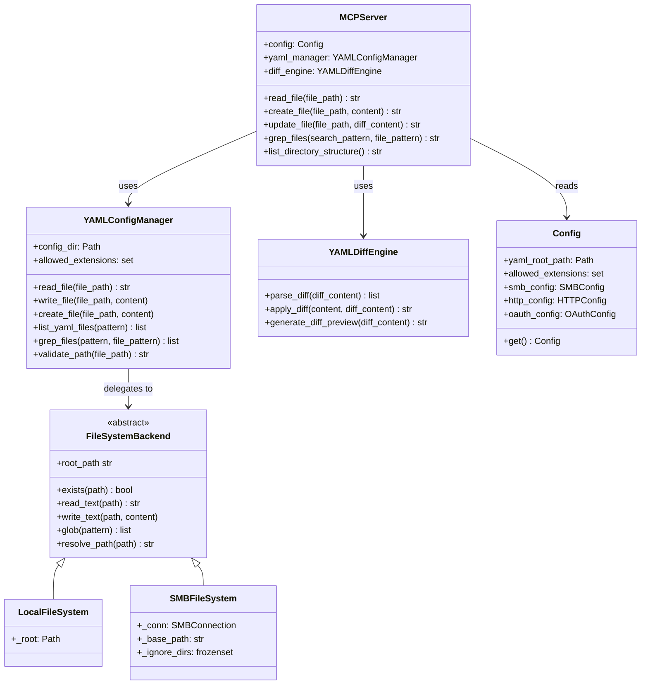
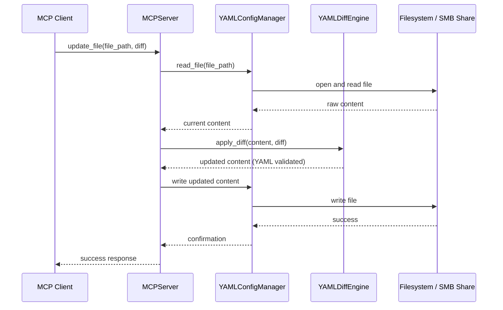

# MCP YAML Filesystem Manager

A secure MCP server for managing YAML configuration files. This tool provides AI assistants with controlled access to YAML files through the Model Context Protocol (MCP). Originally built for managing Home Assistant configuration files, it works with any YAML-based configuration system.

Supports both local directories and SMB network shares (useful for accessing Home Assistant configs on a NAS or remote server).

## Features

- Read, create, and update YAML files with syntax validation
- Surgical file edits using SEARCH/REPLACE diff blocks
- Grep search across all managed YAML files
- Directory tree listing
- SMB network share support without requiring system mounts or root privileges
- Path traversal protection and extension whitelisting
- HTTP transport with optional Google OAuth authentication for remote access
- Docker deployment for network-accessible MCP server mode

## Architecture

### Component Overview



### Happy Path Flow



## Usage

### Option A: Docker (recommended for remote/SMB access)

1. Clone and configure:

```bash
git clone https://github.com/max-rousseau/mcp-yamlfilesystem.git
cd mcp-yamlfilesystem
cp .env.example .env
cp config/config.example config/config
chmod 600 config/config
```

2. Edit `config/config` with your YAML source (see [Configuration](#configuration) below). The config file mount is **required** — the container will not start without it.

3. For local mode, add a data volume to `docker-compose.yml`:

```yaml
volumes:
  - ./config/config:/home/mcp/.config/mcp-yamlfilesystem/config:ro
  - /path/to/your/yaml/files:/data:rw
```

4. Build and start:

```bash
docker compose up -d --build
```

5. Add to Claude Desktop (`~/Library/Application Support/Claude/claude_desktop_config.json`):

```json
{
  "mcpServers": {
    "yaml-filesystem": {
      "command": "npx",
      "args": ["mcp-remote", "http://127.0.0.1:8000/mcp"]
    }
  }
}
```

### Option B: pipx (recommended for local directories)

1. Install:

```bash
pipx install mcp-yamlfilesystem
```

2. Add to Claude Desktop (`~/Library/Application Support/Claude/claude_desktop_config.json`):

```json
{
  "mcpServers": {
    "yaml-filesystem": {
      "command": "mcp-yamlfilesystem",
      "args": ["--local-path", "/path/to/your/yaml/files"]
    }
  }
}
```

For SMB access via pipx, copy `config/config.example` to `~/.config/mcp-yamlfilesystem/config` and configure the SMB settings there.

### Configuration

Edit `config/config` (Docker) or `~/.config/mcp-yamlfilesystem/config` (pipx). See `config/config.example` for all options.

**Local directory:**
```
MCP_FILESYSTEM_LOCAL_PATH=/data
```

**SMB network share:**
```
MCP_FILESYSTEM_SMB_PATH=//nas.local/homeassistant/config
MCP_FILESYSTEM_SMB_USER=your_username
MCP_FILESYSTEM_SMB_PASSWORD=your_password
MCP_FILESYSTEM_SMB_IGNORE_DIRS=deps,.storage,backups,__pycache__
```

### Available Tools

| Tool | Description |
|------|-------------|
| `read_file` | Read contents of a YAML file |
| `create_file` | Create a new YAML file with syntax validation |
| `update_file` | Surgical edits using SEARCH/REPLACE diff blocks |
| `grep_files` | Search for patterns across YAML files |
| `list_directory_structure` | View directory tree |

### CLI Options

| Flag | Description |
|------|-------------|
| `--local-path PATH` | Path to directory containing YAML files |
| `--test` | Test connection to configured filesystem and exit |
| `--http` | Enable HTTP streaming transport (default: stdio) |
| `--host HOST` | Host address for HTTP transport |
| `--port PORT` | Port for HTTP transport |
| `--path PATH` | Endpoint path for HTTP transport |
| `--oauth-enabled true/false` | Enable/disable OAuth for HTTP mode |
| `--oauth-base-url URL` | Public URL for OAuth callbacks |

## Security Considerations

- **Local mode**: Path traversal protection resolves symlinks before validating containment, preventing escape from the configured root directory.
- **SMB mode**: Path containment is enforced textually (normalizing `..` components). Symlinks on the remote share are **not** resolved, so containment depends on share-level permissions configured on the SMB server. Restrict share access to the intended directory tree.
- **HTTP mode**: The built-in HTTP transport does not enforce rate limiting or connection limits. When exposing the server over a network, deploy behind a reverse proxy (nginx, caddy, traefik) with appropriate rate limiting and request size constraints.